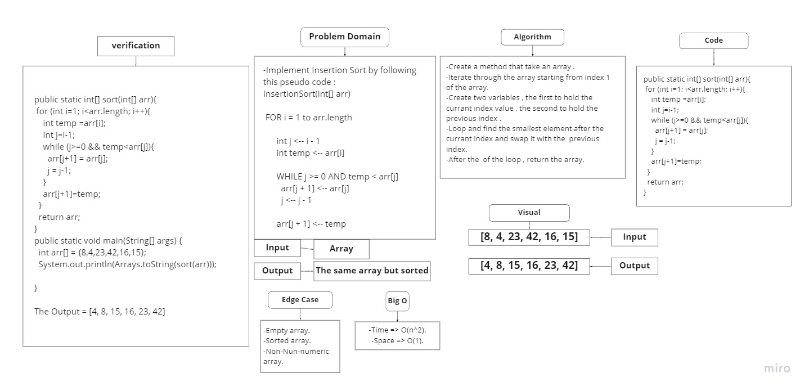
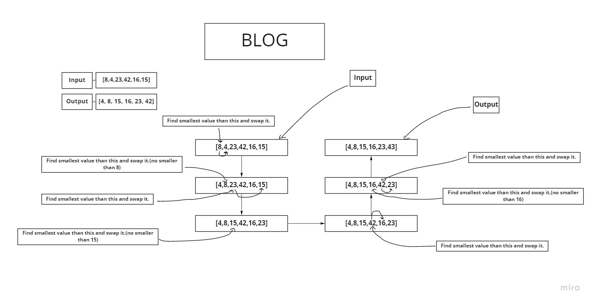
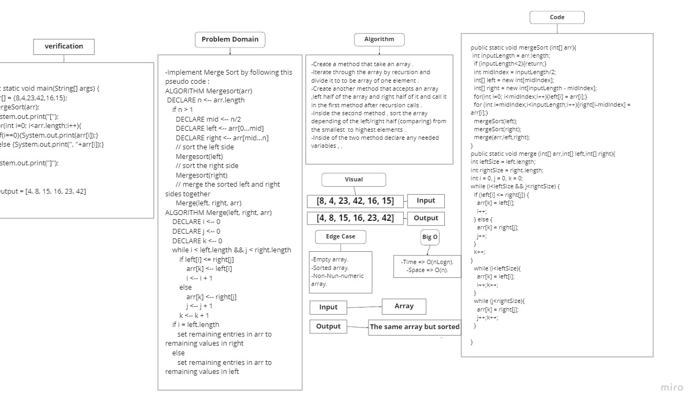
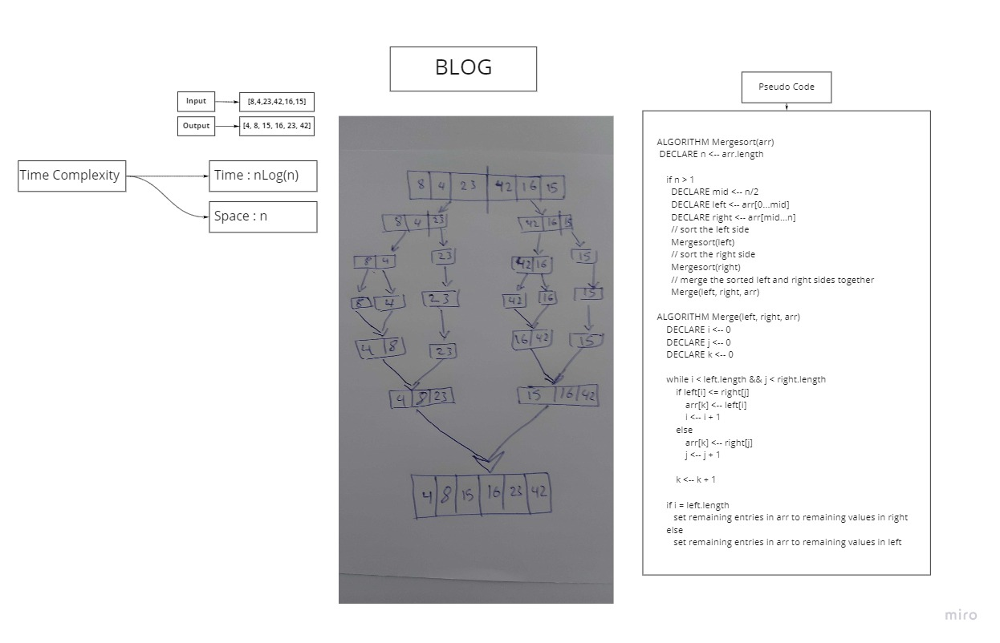

# Challenge 26
## Challenge Summary
Implement Insertion Sort by following a pseudocode.

### Whiteboard Process

### Approach & Efficiency
- Nested Loop Approach.
- BigO of(o^2) for time.
- BigO of(1) for space.

### Blog

#### ===============================================================================
# Challenge 27
## Challenge Summary
Implement Merge Sort by following a pseudocode.

### Whiteboard Process

### Approach & Efficiency
- Nested Loop Approach.
- BigO of(nLog(n)) for time.
- BigO of(n) for space.

### Blog

