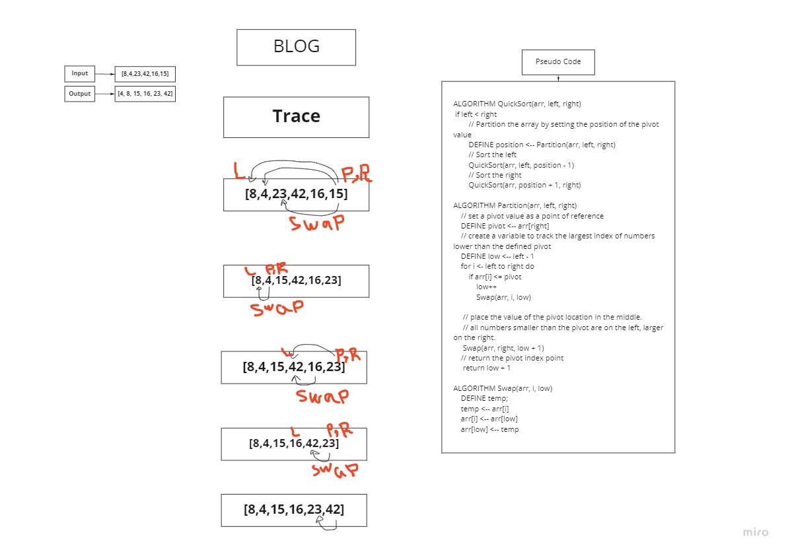

# Challenge 26
## Challenge Summary
Implement Insertion Sort by following a pseudocode.

### Whiteboard Process


### Approach & Efficiency
- Nested Loop Approach.
- BigO of(o^2) for time.
- BigO of(1) for space.

### Blog


#### ===============================================================================
# Challenge 27
## Challenge Summary
Implement Merge Sort by following a pseudocode.

### Whiteboard Process


### Approach & Efficiency
- Nested Loop Approach.
- BigO of(nLog(n)) for time.
- BigO of(n) for space.

### Blog

#### ===============================================================================
# Challenge 28
## Challenge Summary
Implement Quick Sort by following a pseudocode.
## Pseudocode
```
ALGORITHM QuickSort(arr, left, right)
    if left < right
        // Partition the array by setting the position of the pivot value
        DEFINE position <-- Partition(arr, left, right)
        // Sort the left
        QuickSort(arr, left, position - 1)
        // Sort the right
        QuickSort(arr, position + 1, right)

ALGORITHM Partition(arr, left, right)
    // set a pivot value as a point of reference
    DEFINE pivot <-- arr[right]
    // create a variable to track the largest index of numbers lower than the defined pivot
    DEFINE low <-- left - 1
    for i <- left to right do
        if arr[i] <= pivot
            low++
            Swap(arr, i, low)

     // place the value of the pivot location in the middle.
     // all numbers smaller than the pivot are on the left, larger on the right.
     Swap(arr, right, low + 1)
    // return the pivot index point
     return low + 1

ALGORITHM Swap(arr, i, low)
    DEFINE temp;
    temp <-- arr[i]
    arr[i] <-- arr[low]
    arr[low] <-- temp
```
## Working Code
```java
public class App {
    private static void swap(int[] arr, int i, int j) {
        int temp = arr[i];
        arr[i] = arr[j];
        arr[j] = temp;
    }

    private static int partition(int[] arr, int low, int high) {
        int pivot = arr[high];
        int i = low - 1;
        for (int j = low; j < high; j++) {
            if (arr[j] < pivot) {
                i++;
                swap(arr, i, j);
            }
        }
        swap(arr, (i + 1), high);
        return (i + 1);
    }

    public static void quickSort(int[] arr, int low, int high) {
        if (low < high) {
            int pi = partition(arr, low, high);
            quickSort(arr, low, (pi - 1));
            quickSort(arr, (pi + 1), high);
        }
    }
  public static void main(String[] args) {
    int arr[] = {8,4,23,42,16,15};
    System.out.println(Arrays.toString(arr));
    quickSort(arr,0,arr.length-1);
    System.out.print("[");
    for(int i=0; i<arr.length;i++){
      if(i==0){System.out.print(arr[i]);}
      else {System.out.print(", "+arr[i]);}
    }
    System.out.print("]");
  }
}

```
## Trace
Sample Array: [8,4,23,42,16,15]


## Efficiency
1. Time:O(n2) in the worst case.
2. Space: The worst case space used will be `O(n)` .


