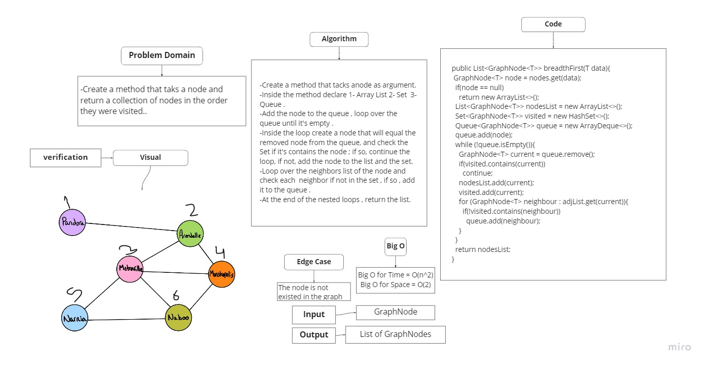

# Graphs
## Challenge 35

## Challenge
Implement A Graph with 5 methods:
- addNode.
- addEdge.
- getNodes.
- getNeighbors.
- size.

## Approach & Efficiency

- Big O for time for (addNode , addEdge , getNodes , getNeighbors ) is : O(n)
- Big O for time for (size) is : O(1)

Big O for space is : O(n^2)

## API
- addNode : will add a new node to the graph.
- addEdge : will add a new edge between two nodes in the graph (bidirectional).
- getNodes : will return a list of all nodes in the graph.
- getNeighbors : will return all nodes that have an edges with the given node.
- size : will return the number of the nodes in the graph.
## ===========================================================
## Challenge 36

## Challenge
- Create a method that takes a node and return a collection of nodes in the order they were visited.
-
- ## Approach & Efficiency

- Big O for time  : O(n^2)
- Big O for space is : O(n)

## Whiteboard Process

## API
- breadthFirst method : Will return a collection of nodes in the order they were visited.
