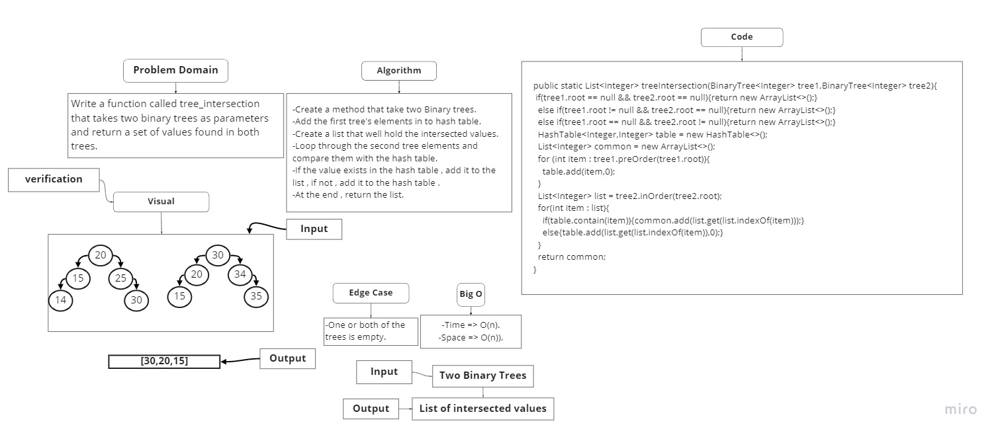

## Challenge 30
Create a Hash Table

## Approach & Efficiency
Big O for Time : O(n)
Big O for Space : O(n)

## API
add method : add a new node in to the bucketArray depending on the hashed key.
get method : return the value of the node depending on the index of the given key.
contain method : return true/false if the node of a given key exist/not exist in the hash table.
hash method : return an integer number , which is the hashed key.
## ===================================================================================
## ===================================================================================
## ===================================================================================
## Challenge 31
Create a method that takes a string and finds and returns the first word to occur more than once in a string.

## Approach & Efficiency
Big O for Time : O(n)
Big O for Space : O(n)

## Whiteboard Process

## ===================================================================================
## ===================================================================================
## Challenge 32
Write a function called tree_intersection that takes two binary trees as parameters and return a set of values found in both trees.

## Approach & Efficiency
Big O for Time : O(n)
Big O for Space : O(n)

## Whiteboard Process

## ===================================================================================
## Challenge 33
Write a function called left join that accepts   two hash maps and returns that's combine the key and corresponding values (if they exist) into the array according to LEFT JOIN logic.

## Approach & Efficiency
Big O for Time : O(n)
Big O for Space : O(n)

## Whiteboard Process

