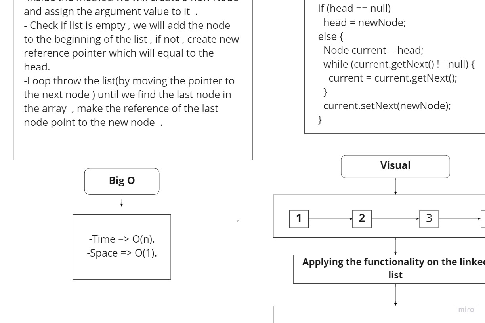

# Singly Linked List
A Linked List is a sequence of Nodes that are connected/linked to each other. The most defining feature of a Linked List is that each Node references the next Node in the link.

## Challenge
Create a Node class that has properties for the value stored in the Node. Create a Linked List class

## Approach & Efficiency
LinkedList approach because is store in dynamic location.
Big O n/1 for insert in first.
Big O 1/n for includes.

## API
have method :
1. toString.
2. includes.
3. insert.
----------------------------------------------------------------------------------
# Challenge Summary
Add a new value to the end of the linked list.
Add a new value before a specific node in the linked list.
Add a new value after a specific node in the linked list.

## Whiteboard Process

## Approach & Efficiency
LinkedList approach because is store in dynamic location.
Big O n/1 for insert in first.
Big O 1/n for includes.

## API
have method :
1. append.
2. insert before.
3. insert after.
