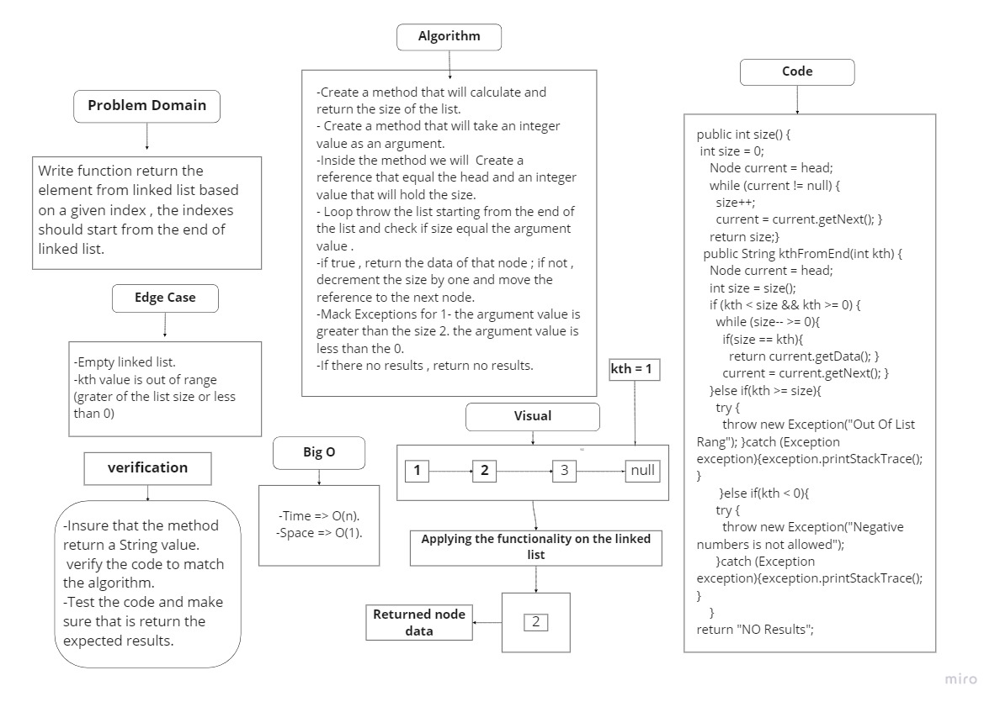
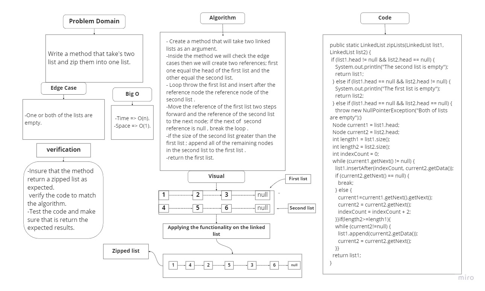

# Singly Linked List
A Linked List is a sequence of Nodes that are connected/linked to each other. The most defining feature of a Linked List is that each Node references the next Node in the link.

## Challenge
Create a Node class that has properties for the value stored in the Node. Create a Linked List class

## Approach & Efficiency
LinkedList approach because is store in dynamic location.
Big O(n) for Time.
Big O(1) for Space.

## API
have method :
1. toString.
2. includes.
3. insert.
----------------------------------------------------------------------------------
# Challenge Summary
Add a new value to the end of the linked list.
Add a new value before a specific node in the linked list.
Add a new value after a specific node in the linked list.

## Whiteboard Process

## Approach & Efficiency
LinkedList approach because is store in dynamic location.
Big O(n) for Time.
Big O(1) for Space.

## API
have method :
1. append.
2. insert before.
3. insert after.

-----------------------------------------------------------------------
# Challenge Summary
Write function return the element from linked list based on given index , the indexes should start from the end of linked list.

## Whiteboard Process

## Approach & Efficiency
LinkedList approach because is store in dynamic location.
Big O(n) for Time.
Big O(1) for Space.

## API
have method :
1.kthFromEnd method
-----------------------------------------------------------------------
# Challenge Summary
Write Write a method that take's two list and zip them into one list.

## Whiteboard Process

## Approach & Efficiency
LinkedList approach because is store in dynamic location.
Big O(n) for Time.
Big O(1) for Space.

## API
have method :
1.zipLists.
