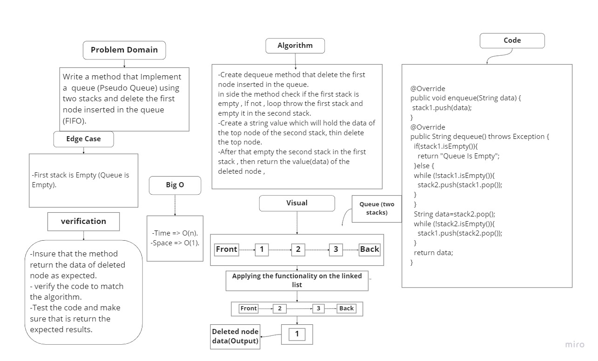

# Stacks and Queues

## Challenge
Create A Stack and it's methods.
1. push method.
2. pop method.
3. isEmpty method.
4. peek method.
----------------------------------
Create A Queue and it's methods.
1. enqueue method.
2. dequeue method.
3. isEmpty method.
4. peek method.
## Approach & Efficiency
Stack approach .
- Big O(1) for Time For Every method.
- Big O(1) for Space For Every method.
Queue approach .
- Big O(1) for Time For Every method.
- Big O(1) for Space For Every method.
-------------------------------------------------
# Pseudo Queues
## Challenge
Create A Queue using two Stacks.
1. Queue interface with two methods
- enqueue.
- dequeue.
## Approach & Efficiency
Stack approach .
enqueue method :
- Big O(1) for Time For Every method.
- Big O(1) for Space For Every method.
- dequeue method :
- Big O(n) for Time For Every method.
- Big O(1) for Space For Every method.
- ## WhiteBoard :
- 
