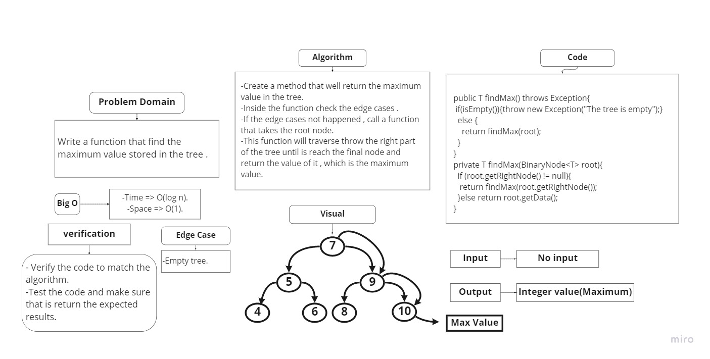

# Trees
## Challenge
Create a Binary Search Tree class with two methods:
- add method: Add a new node in the right place of the tree.
- contains method: Returns boolean indicating whether or not the value is in the tree .

## Approach & Efficiency
tree Approach
Bog O(Log of n) for time.
Bog O(1) for space.

## API
- add method: Add a new node in the right place of the tree.
- contains method: Returns boolean indicating whether or not the value is in the tree .
========================== challenge 16 =======================
# Tree-max
## Challenge
Create a method that will find the maximum value in the tree .

## Approach & Efficiency
tree Approach
Bog O(Log of n) for time.
Bog O(1) for space.

## API
- findMax method: will find the maximum value in the tree and return it .
## WightBoard :

