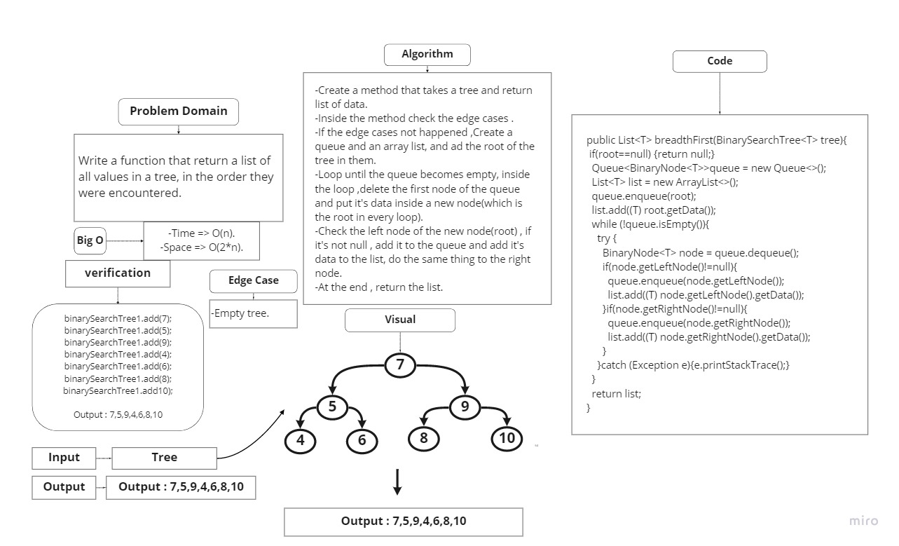
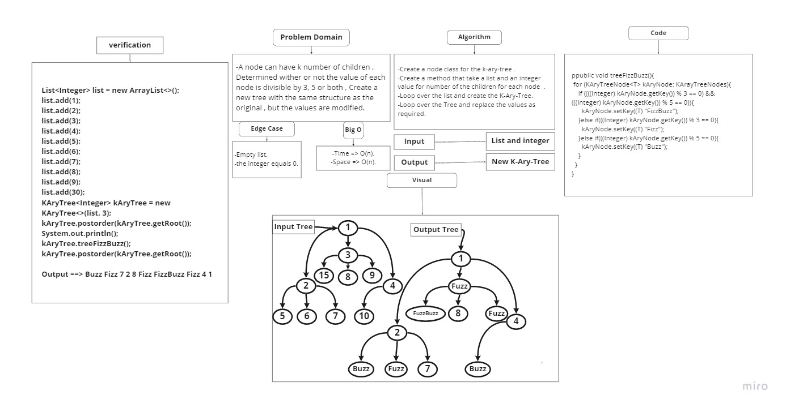

# Trees
## Challenge
Create a Binary Search Tree class with two methods:
- add method: Add a new node in the right place of the tree.
- contains method: Returns boolean indicating whether or not the value is in the tree .

## Approach & Efficiency
tree Approach
Bog O(Log of n) for time.
Bog O(1) for space.

## API
- add method: Add a new node in the right place of the tree.
- contains method: Returns boolean indicating whether or not the value is in the tree .
========================== challenge 16 =======================
# Tree-max
## Challenge
Create a method that will find the maximum value in the tree .

## Approach & Efficiency
tree Approach
Bog O(Log of n) for time.
Bog O(1) for space.

## API
- findMax method: will find the maximum value in the tree and return it .
## WightBoard :

========================== challenge 17 =======================
# Tree-breadth-first
## Challenge
Write a function that return a list of all values in a tree, in the order they were encountered.

## Approach & Efficiency
tree Approach
Bog O(n) for time.
Bog O(2*n) for space.

## API
- breadthFirst method: will return a list of all values in a tree .
## WightBoard :

========================== challenge 18 =======================
# FizzBuzz on a k-ary tree
## Challenge
-A node can have k number of children , Determined wither or not the value of each node is divisible by 3, 5 or both , Create a new tree with the same structure as the original , but the values are modified.

## Approach & Efficiency
tree Approach
Bog O(n) for time.
Bog O(n) for space.

## API
- treeFizzBuzz method:
-  If the value is divisible by 3, replace the value with “Fizz”
-  If the value is divisible by 5, replace the value with “Buzz”
-  If the value is divisible by 3 and 5, replace the value with “FizzBuzz” .
## WightBoard :

